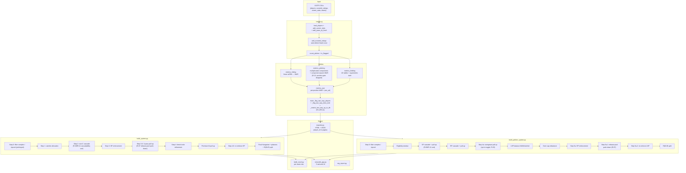

# Pistachio — Handover

## What this is

OOTP Baseball roster-construction tool. Takes the user's CSV exports from any
OOTP save, runs a metrics pipeline, then assigns every player to one of 7
levels (MLB → AAA → AA → A+ → A → R → R(DLR)) with positional Hungarian,
high-potential prospect enforcement, platoon-aware lineups, per-position
depth charts, bullpen handedness balance, and (R-08–R-14) two-way player
handling. Renders to xlsx and a Streamlit web UI.

## Where the work lives

- Branch `main` on the `pistachio` repo (this directory).
- Local raw sim data at `OOTP simulation/OOTP sims.xlsx` (committed).
- Canonical OOTP save: **`Rockies Rebuild.lg`** (`config.filepath`).
- Active testing save: **`Corbin HoF.lg`** (used to validate two-way
  features — has Ohtani at LAD).
- Recent HEAD progression (2026-05-10):
  - `217ff56` — R-14: tighten two-way to MLB-tier + SP→DH restriction
  - `5bc3948` — R-13: two-way in BOTH pools (LAD gets free extra slot)
  - `815fff0` — R-12: organic two-way placement (best-side only, no pin)
  - `e7c2e3d` — R-11: cascade sort by cascadability flag (not distance)
  - `c60da78` — R-10: two-way pitchers count once (pitcher slot only)
  - `ad0e74b` — R-09: bot-aware cascade sort (stuck-vet protection)
  - `0a149f3` — R-08: two-way player handling — same-level pin (later
    superseded by R-12 / R-13 / R-14)
  - `bfec091` — R-07: release-pool push-down (PASS 3) for both builders
  - `50deea4` — R-06: roster expansion (15/15/16/16/16/16) + hitter
    pull-up +1 stretch
  - `c90bb90` — R-05: raise `HP_PITCHER_MAX_PWOBAP` .330 → .340
  - `8a3aceb` — Bug fixes: drop wOBAP export floor; fix injury name
    collision (use player_id from CSV, not bare name)
  - `9fd32aa` — R-04: lower `HP_WOBA_THRESHOLD` .340 → .330

## How to run

From PowerShell, in the project directory:

```powershell
python -m streamlit run streamlit_app.py
```

Browser opens at `http://localhost:8501`. Session-scoped gate forces a
fresh upload every browser tab — drop in OOTP CSVs from
`saved_games/<your save>.lg/import_export/csv/`.

Required: `players.csv`, `players_scouted_ratings.csv`.
Optional: `players_career_*_stats.csv` (IP / PA + service time);
`teams.csv` (drives R(DLR) DSL-team count + scales R(DLR) capacity);
`leagues.csv` (per-level attribute averages — currently unused after
the level-fit feature was reverted, kept for future).

CLI:

```powershell
python app.py refresh                                    # canonical save
python app.py refresh --csv-dir "<other save>/csv"       # any other save
python app.py rosters --team COL
```

Run the test suite (~60s): `python -m pytest tests/`.

## Pipeline at a glance



## Test harness (T-01, post-2026-05-10)

`tests/test_roster_invariants.py` runs `main()` for all 30 MLB orgs and
asserts 11 invariants per org (330 total cases). Catches the entire
class of bugs spotted in this session by reading rosters manually:

- No service-floor (`_bot`) violations
- No over-capacity rosters
- Each HP appears at exactly one level
- `placed + overflow + flagged + complex == loaded` (no lost players)
- MLB has 13 hitters, SP slots respect stamina gate, LHP balance honoured
- Two-way `_level_fit_tag` invariants (where applicable)

Retired since the earlier session:
- `test_hitter_no_top_violations` — `_top` ceiling is intentionally
  relaxed by Step 3.6 PASS 3 release-pool push-down (R-07).
- `test_pitcher_top_within_one_stretch` — same reason, pitcher PASS 3.

Current state: **329/330 passing.** The 1 persistent red is
`test_pitcher_lhp_balance[TB]` (or sometimes `[AZ]`/`[NYY]` depending
on the auto-detected head scout) — a data-drift / org-data property,
not a builder regression. Has been ignored across every R-XX commit.

`pytest tests/` runs in ~60s. **Run it after any builder change.**

## Major behavioural changes this session (R-04 → R-14)

### R-06: roster expansion
Minor-league per-level sizes increased to better match real MiLB depth:
- **AAA / AA**: 15 hitters, 15 pitchers (5 SP + 10 RP). Was 13.
- **A+ / A / R / R(DLR)**: 16 hitters, 16 pitchers (6 SP + 10 RP). Was 13/13/15/15.
- **MLB**: unchanged at 13 / 13 (5 SP + 8 RP).

`SP_PER_LEVEL` and `RP_PER_LEVEL` are now per-level dicts (were scalars).
All callers updated. Pitcher Step 5b R(DLR) sub-team split now reads
`ROSTER_SIZES['R(DLR)']` instead of a hardcoded 15 — that hardcode was
silently dropping the 16th player at every DSL sub-team after the
expansion.

### R-07: release-pool push-down (PASS 3)
The cascade naturally leaves some levels under-filled even after pull-up.
A new PASS 3 in both builders pulls from `overflow` to fill any remaining
slots, ignoring `_top` and respecting only `_bot` (the OOTP hard rule).
Catchers are eligible (Hungarian routes them to any field-qualifying
position). Cuts release-pool sizes by 50-70% across most orgs.

After push-down on the pitcher side, an LHP-balance re-enforcement runs
to make sure LHP-reserved bullpen slots aren't filled by a RHP.

### R-09 + R-11: bot-aware cascade sort
The original cascade demoted the worst-priority player when a level was
over-cap, ignoring `_bot` mobility. That meant a "stuck" `_bot=A+` vet
with lowest priority would cascade out of A+ and overflow — even when
the level had wide-`_bot` prospects who could've cascaded further down.

**R-11** (refining R-09): sort key is now `(_bot > lvl_idx, priority)`.
Position 0 = stuck (can't cascade further) + best priority (kept).
Position -1 = cascadable + worst priority (popped first). Stuck players
are protected at the front; only the WORST cascadable player gets
popped, regardless of how far they could cascade. (R-09's earlier
`(_bot - lvl_idx, priority)` mobility-distance sort over-punished
high-quality young prospects with `_bot=R(DLR)` because they appeared
"most-mobile".)

### R-08 → R-14: two-way player handling (4 iterations)

Currently shipping (R-14 final state):

- **Detection** (`main._flag_two_way_players()`): a player is two-way
  iff their CURRENT `wOBA >= WOBA_MIN_HITTER['MLB']` (.280) AND CURRENT
  `pwOBA <= PWOBA_MAX['MLB']` (.345). Both MLB-tier. Captures Shohei
  Ohtani (LAD, wOBA=.429, pwOBA=.310) only — exactly 1 flagged in
  Rockies Rebuild and Corbin HoF.
- **`metrics_pitching` position gate dropped** (R-12): every player
  gets a computed `pwOBA` / `sp_war` / `rp_war` regardless of OOTP
  `position`. Needed because Ohtani in OOTP is `position=10` (DH) with
  `role=11` (Starter) — the position gate would zero his pwOBA.
- **Best-side flag** (`tw_best_side` in {`hitter`, `pitcher`}, R-12):
  side with higher expected WAR contribution. Currently used for
  display only.
- **Admit to BOTH pools** (R-13): two-way appears in both `hitters.json`
  and `pitchers.json` and takes a slot on each side. LAD effectively
  has one "free" slot because Ohtani fills two roles as one player.
- **SP→DH restriction** (`main._restrict_two_way_sp_to_dh()`, R-14):
  for SP-viable two-way, NaN all non-DH `*_adj` / `*_fld` / raw `*`
  columns and force `pos_adj='DH'`, `field='DH'`, `best_adj=DH_adj`.
  The Hungarian then places them at DH only. (Shohei rule — an SP can
  DH on non-pitching days but can't field.) RP-only two-way are not
  restricted (none exist currently but the rule is correct).

The earlier "pin" implementations (R-08 Step 4.7 / Step 5a.3) were
**retired in R-10** because they were over-promoting marginal-MLB
two-way pitchers (Tolle pwOBA=.337 over Bello pwOBA=.322 at BOS).
Replaced with organic cascade competition + admission filters.

Verified on Corbin HoF:
- **Shohei Ohtani (LAD)**: in both JSONs. Hitter side → LAD MLB **DH**
  starter. Pitcher side → LAD MLB **SP**, pwOBA=.308 (2nd-best in rotation).
- **Tolle (BOS), Grice + Forbes (AZ)**: not flagged (their CURRENT wOBA
  is below the .280 floor; only pitching potential is there). Pitcher
  pool only — same as a pure SP.

### Bug fixes (`8a3aceb`)
- `wOBAP > 0.200` export floor dropped — was hiding deep-R / R(DLR)
  prospects (e.g. AZ's Robert Lantigua, age 18, wOBAP=.185). Now
  `wOBAP.notna() & (position != 1)` for hitters.
- Injury name-collision: `_load_injured_names()` now returns
  `{'pids': set[int], 'names': set[str]}`. OOTP CSV injuries match
  by `player_id` (unambiguous). `injured.txt` manual entries still
  match by name. New `is_player_injured(p, injured)` helper unifies
  the check. Fixed AZ's 18yo Jose Rodriguez being falsely flagged
  as injured because LAD's 24yo Jose Rodriguez actually was.
- `player_id` added to all `EXPORT_PAGES` so downstream code can
  match unambiguously.

## Tunable thresholds (config.py)

All roster-construction thresholds live in `config.py` under the
"Roster builder tunables" section. Tweak any without source edits:

| Constant | What it controls | Default |
|---|---|---|
| `ROSTER_SIZES_HITTER` | Per-level hitter slot capacity | MLB=13, AAA/AA=15, A+/A/R/R(DLR)=16 |
| `WOBA_MIN_HITTER` | Per-level wOBA eligibility floor | MLB=.280, AAA=.250, AA=.220, A+=.210, A=.200, R=.165, R(DLR)=-1.0 |
| `PREMIUM_WOBA_RELAX` | wOBA floor relax for C/SS/CF | .005 |
| `LINEUP_RHP_WEIGHT` | Standard-lineup vs-RHP weighting | .725 |
| `C_FLD_WEIGHT`, `AGE_WEIGHT`, `AGE_CAP` | catcher_alloc_score components | .05 / .002 / 30 |
| `C_FLD_GAP_MAX` | Max non-C glove gap for catcher candidate | 1.5 |
| `CATCHER_RESCUE_MIN_NON_C_WAR` | Bnw threshold for catcher-bypass rescue | 1.5 (R-01) |
| `CATCHER_RESCUE_NON_C_POSITIONS` | Positions counted in bnw | DH, 1B, LF, RF, 3B |
| `HP_MAX_AGE`, `HP_BESTP_ADJ_THRESHOLD`, `HP_WOBA_THRESHOLD` | Hitter HP gate | 24 / 2.0 / **.330** (R-04, was .340) |
| `PREMIUM_FLD_MIN`, `HP_PREMIUM_FIT_POSITIONS` | Premium-glove anchor | 1.5 / (CF, SS, 2B) |
| `IF_POSITIONS`, `OF_POSITIONS` | Position groupings for utility roles | (2B, 3B, SS) / (LF, CF, RF) |
| `SP_PER_LEVEL`, `RP_PER_LEVEL` | Per-level rotation / bullpen size (dicts, R-06) | MLB=5/8, AAA/AA=5/10, A+/A/R/R(DLR)=6/10 |
| `PWOBA_MAX` | Per-level pwOBA ceiling | MLB=.345, AAA=.370, AA=.385, A+=.395, A=.405, R=.420, R(DLR)=1.0 |
| `LHP_LEVELS`, `LEFTY_MIN/TARGET/MAX`, `LEFTY_TARGET_MAX_COST` | Bullpen handedness balance | (MLB,AAA,AA) / 2,3,4 / 0.010 |
| `HP_PITCHER_MAX_AGE`, `HP_PITCHER_MAX_PWOBAP` | Pitcher HP gate | 24 / **.340** (R-05, was .330) |
| `PITCHER_SWINGMAN_PULLUP_ENABLED` | Opt-in R-03 toggle (long-relief pull-up) | **False** |
| `PITCHER_SWINGMAN_PULLUP_MIN_WARP_DELTA` | Threshold for swingman call-up | 0.5 |

Two-way detection thresholds are hard-coded in
`main._flag_two_way_players` against `WOBA_MIN_HITTER['MLB']` and
`PWOBA_MAX['MLB']` — adjust those base constants if you want to
loosen the gate.

## Catcher rescue rule (R-01)

`build_system.main` Step-1.5 routes a primary catcher through the
non-catcher cascade if BOTH:
- `_top == MLB` (wOBA clears MLB threshold), AND
- `best_non_c_war(p) >= CATCHER_RESCUE_MIN_NON_C_WAR` (1.5)

Effect: only bat-elite catchers (Soderstrom, Smith, Wells, Langeliers,
Raleigh, etc.) bypass alloc_score-based Step-1 catcher allocation.
Defense-first backups stay in Step-1 where their glove drives placement.

## R-03 swingman toggle (opt-in)

When `PITCHER_SWINGMAN_PULLUP_ENABLED = True`, an extra Step-4a pass
pulls non-MLB SP-viable non-HP arms up to the MLB bullpen if their
`rp_warP` exceeds the worst MLB RP's by 0.5+ WAR, preserving MLB LHP
balance. Off by default — most candidates are net-negative in
current-year `rp_war` (only positive in projected `rp_warP`).

## Two-way handling (R-14 current state)

Detection (`main._flag_two_way_players`):
- `position` is incidental (gate dropped in `metrics_pitching`)
- BOTH `wOBA >= .280` (MLB hitter floor) AND `pwOBA <= .345` (MLB
  pitcher cap) must hold

This is strict by design — typical false-positive load at the previous
looser threshold was ~99 players (regular MLB position players whose
default pitching ratings compute to a plausible pwOBA, and regular MLB
pitchers whose default batting computes to wOBA ~.215). Tightening
to MLB-on-both-sides isolates Ohtani-tier only.

Routing:
- `tw_best_side` set to `hitter` or `pitcher` (higher of
  `war_hitting` vs `max(sp_war, rp_war)`) — used for display badges.
- Both `hitters.json` and `pitchers.json` admit `is_two_way` rows.
- Two-way takes a slot on BOTH sides — the org effectively gains one
  "free" extra unique player elsewhere because the same person fills
  two roles.

SP→DH restriction (`_restrict_two_way_sp_to_dh`):
- If a two-way is SP-viable, all their non-DH `*_adj`, `*_fld`, `*P_adj`
  columns are NaN'd and their `pos_adj` / `field` / `best_adj` are
  fixed to the DH side.
- Result: SP two-way → DH on hitter side only (Shohei rule).
- RP-only two-way are unrestricted (none exist in current data).

## Critical files

| File | Role |
|---|---|
| `config.py` | All constants + roster tunables |
| `roster_common.py` | Shared eligibility utils. `_load_injured_names` returns `{'pids', 'names'}` since 2026-05-10 |
| `metrics_pitching.py` | Multiplicative components + component-aware WAR. **Position gate dropped (R-12)** — `pwOBA`/`sp_war`/`rp_war` computed for every row |
| `metrics_hitting.py` | Linear wOBA → runs → WAR |
| `metrics_fielding.py` | 1D tables + asymmetric-tanh saturation |
| `metrics_war.py` | Per-position bat+def+pos_adj |
| `main.py` | `compute_df` + new two-way helpers: `_flag_two_way_players`, `_flag_two_way_best_side`, `_restrict_two_way_sp_to_dh` |
| `build_system.py` | Hitter rosters. Step 0–4.6 + R-07 push-down + R-11 cascadability sort |
| `build_pitcher_system.py` | Pitcher rosters. SP/RP cascades + pull-up + LHP balance + R-07 push-down + R-11 sort |
| `exporter.py` | `EXPORT_PAGES` filters admit two-way to both pools; `player_id`, `is_two_way`, `tw_best_side`, `position` columns added |
| `build_excel.py` | xlsx renderer |
| `streamlit_app.py` | 5-tab UI |
| `tests/test_roster_invariants.py` | 330-case regression harness |
| `tests/conftest.py` | Pytest fixtures + per-org parametrize |
| `outputs/PIPELINE_REVIEW.md` | Methodology / code-quality review |

## Sample WAR values (Rockies Rebuild save)

### Top hitters by position
| Pos | Player | best_adj |
|---|---|---|
| SS | Bobby Witt Jr. (KC) | ~6.5 |
| 3B | Corey Seager (TEX) | ~6.2 |
| RF | Kyle Tucker (LAD) | ~7.2 |
| CF | Roman Anthony (BOS, rookie) | ~7.7 |
| C | Cal Raleigh (SEA) | ~5.4 |

### Top pitchers
| Pitcher | sp_war |
|---|---|
| Tarik Skubal (DET) | ~5.6 |
| Garrett Crochet (BOS) | ~4.9 |
| Paul Skenes (PIT) | ~4.7 |

### Two-way (Corbin HoF — Ohtani only)
| Player | Hitter side | Pitcher side |
|---|---|---|
| Shohei Ohtani (LAD) | MLB DH (best_adj from DH_adj, ~5.0) | MLB SP, pwOBA=.308 |

## What's still pending

See `outputs/PIPELINE_REVIEW.md` for the full prioritised action list.
Highlights of what's NOT done:

1. **M-03 (pitcher RP leverage WAR)** — currently
   `rp_war = sp_war × 0.333` (workload only). FG applies leverage
   multiplier (~1.5-2× for closers). Acceptable as cosmetic /
   external-comparability gap.
2. **M-05 (IF cross-position routing)** — ~9/35 elite-glove DRS
   leaders mismatch. Needs new 2D RNG×ARM sim data.
3. **C-05 / C-06 (metrics duplication, vectorize df.apply)** —
   code-quality items.
4. **Pitcher platoon staff variants** — `pwOBAR` / `pwOBAL` exist but
   not used for vsR/vsL rotation construction.
5. **Two-way display badge** — `tw_best_side` is exported in the
   JSONs but no UI shows it. Could power a "primary role" indicator
   on the Streamlit views.

## Methodology limitations (carried forward)

- **OOTP wOBA distribution offset**: OOTP star hitters cluster ~22
  wOBA points below MLB (Witt OOTP .354 vs MLB .376). Within-OOTP
  rankings correct.
- **Catcher framing engine plateau**: OOTP caps framing at +8 runs.
  C `pos_adj` is +7.5 vs FG's +12.5 partly because of this.
- **Pitcher RP WAR is workload-only**: see M-03.
- **`metrics_pitching.identify_role` gate now uses stamina only**
  (R-12). Position players without stamina ratings get `sprp=""`.
  Most do have stamina (OOTP populates it for everyone) so this is
  rarely consequential.

## Quick smoke test

```powershell
python app.py refresh
python -m pytest tests/                      # 330 cases, ~60s
python -X utf8 calibration/top10_per_pos.py  # spot-check top players per position
```

Expected: pytest 329/330 (one persistent pre-existing TB / AZ LHP
balance failure). Top SS = Witt ~6.5, top RF = Tucker ~7.2. In Corbin
HoF: Shohei Ohtani at LAD MLB as both DH starter and SP rotation
member.
