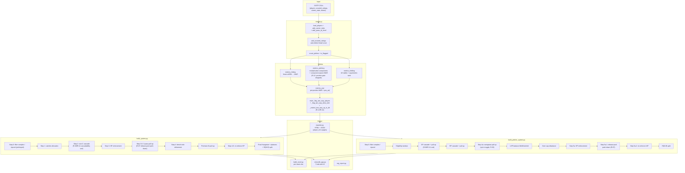

# Pistachio — Handover

## What this is

OOTP Baseball roster-construction tool. Takes the user's CSV exports from any
OOTP save, runs a metrics pipeline, then assigns every player to one of 7
levels (MLB → AAA → AA → A+ → A → R → R(DLR)) with positional Hungarian,
high-potential prospect enforcement, platoon-aware lineups, per-position
depth charts, bullpen handedness balance, and (R-08–R-14) two-way player
handling. Renders to xlsx and a Streamlit web UI.

## Where the work lives

- Branch `main` on the `pistachio` repo (this directory). Remote
  `ootp_app` (github.com/stames999/ootp_app) is tracked; all R-XX
  commits up through R-34 are pushed.
- Local raw sim data at `OOTP simulation/OOTP sims.xlsx` (committed).
- Canonical OOTP save: **`Rockies Rebuild.lg`** (`config.filepath`).
- Active testing save: **`Corbin HoF.lg`** (used through R-27; R-28+
  validated against `Rockies Rebuild.lg`. Both saves cover Ohtani
  cases for two-way handling).
- Recent HEAD progression (2026-05-13/16 sessions, R-15 through R-34):
  - `31e9011` — R-34g: dev-gate requires age ≤ 27 too (Fedde/Martin → MLB pen)
  - `8a372dd` — R-34f: swingman dev-gate (exclude pwOBAP ≤ .345 prospects)
  - `61dc6b2` — R-34e: swingman priority margin 0.020 (stop rotation depletion)
  - `083db24` — R-34d: generalise swingman to AAA/AA/A+/A bullpens
  - `b96d12a` — R-34c: push-down strict + re-run SP pull-up after swingman
  - `8710597` — R-34b: enable swingman + switch to pitcher_priority gate
  - `b575dd8` — R-34a: starter Hungarian gates on FIELD_VIABILITY_GAP (1.75)
  - `dd59fd3`...`ade8c4c` — R-33 cleanup branch (11 commits): gitignore
    outputs/, lift magic numbers to config, `_bot` assert, shared
    cascade/overflow_rebalance helpers in roster_common, light main()
    decomposition, JSON-cache doc, type hints, two-way DH-penalty fix,
    calibration metadata sidecar, methodology review docs
  - `a0c4a4d` — service-time uses career span, not summed yrs_<LEVEL>
  - `2867182` — R-32: blocker penalty in priority blend
  - `1a9d39d` — R-31: HP enforcement aligned with cascade priority (single rule)
  - `a18cb6f` — R-30: priority blend 70/30 → 85/15
  - `2a8aaa1` — FREE sentinel for free agents (was NaN org)
  - `be97d44` — R-29: HP routing — age caps, swap picker, RP pool gate
  - `0169397` — R-28: meritocratic cascade + SP rescue + platoon-split tags
  - `820fb91` — R-27: remove MLB tenure protection entirely (HP block
    is the only soft placement rule; everyone else fair game)
  - `0519e7b` — R-26: fix HP MLB-block over-cascade bug (max → AAA target)
  - `30a7559` — R-25: revert MLB-ready pitcher gate to pwOBA ≤ .335
  - `24543dc` — R-24: two-tier MLB tenure protection (later removed in R-27)
  - `2041a21` — R-23: MLB-ready criterion = current WAR (1.5 / 0.5)
  - `43026b9` — R-22: cascade HP starters at 1B/DH unless truly DH-only
  - `3d0a868` — R-21: flag MLB-ready HP prospects in Overview + Rosters
  - `fba4a98` — R-20: HP hard-block from MLB + tenure protection (the
    tenure half was later removed in R-27)
  - `3f0b0f9` — R-19: sabermetric lineup optimizer (The Book)
  - `1fd19a1` — R-18: traditional slash-line stats (AVG/OBP/SLG/ISO)
  - `2133ddf` — R-17: SP eligibility requires 3+ pitch arsenal
  - `60c3c1c` — R-16: 2B+SS premium pair calibration (2B=+7.5, 3B=0,
    later updated to 2B=+2.5/3B=+2.5 then SS=+7.5/3B=+2.5)
  - `35dd6e3` — R-15: pos_adj calibration to FG 2025 + dynamic team lookup
  - `5dc889b` — Update HANDOFF for R-04 through R-14 session
  - `217ff56` and earlier — R-14 and prior (see git log for full chain)

## How to run

From PowerShell, in the project directory:

```powershell
python -m streamlit run streamlit_app.py
```

Browser opens at `http://localhost:8501`. Session-scoped gate forces a
fresh upload every browser tab — drop in OOTP CSVs from
`saved_games/<your save>.lg/import_export/csv/`.

Required: `players.csv`, `players_scouted_ratings.csv`.
Optional: `players_career_*_stats.csv` (IP / PA + service time);
`teams.csv` (drives R(DLR) DSL-team count + scales R(DLR) capacity);
`leagues.csv` (per-level attribute averages — currently unused after
the level-fit feature was reverted, kept for future).

CLI:

```powershell
python app.py refresh                                    # canonical save
python app.py refresh --csv-dir "<other save>/csv"       # any other save
python app.py rosters --team COL
```

Run the test suite (~60s): `python -m pytest tests/`.

## Pipeline at a glance



## Test harness (T-01, post-2026-05-10)

`tests/test_roster_invariants.py` runs `main()` for all 30 MLB orgs and
asserts 11 invariants per org (330 total cases). Catches the entire
class of bugs spotted in this session by reading rosters manually:

- No service-floor (`_bot`) violations
- No over-capacity rosters
- Each HP appears at exactly one level
- `placed + overflow + flagged + complex == loaded` (no lost players)
- MLB has 13 hitters, SP slots respect stamina gate, LHP balance honoured
- Two-way `_level_fit_tag` invariants (where applicable)

Retired since the earlier session:
- `test_hitter_no_top_violations` — `_top` ceiling is intentionally
  relaxed by Step 3.6 PASS 3 release-pool push-down (R-07).
- `test_pitcher_top_within_one_stretch` — same reason, pitcher PASS 3.

Current state at end of R-27 session: **330/330 passing.** The
previously-persistent rotating LHP-balance flake (TB/AZ/NYY) hasn't
surfaced in recent runs — may have been resolved by the calibration
changes that shifted org-level pool composition. If it reappears it's
still a data-drift property, not a builder regression.

`pytest tests/` runs in ~60s. **Run it after any builder change.**

## Major behavioural changes this session (R-15 → R-34, 2026-05-12/16)

### R-34: starter eligibility gate, generalised swingman, dev-gate

A run of fixes targeting placement bugs surfaced by spot-checks of
specific players. Each iteration addresses a follow-on issue from the
prior one — track the chain top-down.

**(A) `b575dd8` — starter Hungarian gates on `FIELD_VIABILITY_GAP`.**
Trigger: Dustin Harris (CWS, primary 1B with `best_adj=0.61`,
`SS_fld=-2.51`, `SS_adj=-1.31`) was being placed at SS in the vs-LHP
Hungarian. His wOBAL bat advantage compounded with SS's positional
adjustment (+7.5 runs) overcame the -1.31 defensive penalty. New
`is_starter_eligible(p, pos)` helper requires `<pos>_adj` to be within
`FIELD_VIABILITY_GAP` of `best_adj`. Tightened the constant
**2.0 → 1.75**. Both `fill_starters` (vs-RHP weighted) and
`fill_starters_split` (platoon variants) gate on it. Backups stay
rating-floor-eligible. DH always allowed.

**(B) `8710597` — enable swingman pull-up + switch gate to
`pitcher_priority`.** Trigger: older SPs (Fedde/Martin/Sasaki/Tolle/
Urquidy/Joe Rock/Mahle/Beeter) cascaded from MLB rotation were stuck
at AAA SP when their current stuff was clearly MLB-bullpen-grade.
`PITCHER_SWINGMAN_PULLUP_ENABLED` now defaults to `True`. Gate
switched from `rp_warP` projection delta to `pitcher_priority` at
MLB (= pure current pwOBA per the MLB branch of the priority
function) — matches the R-31 single-rule invariant.

**(C) `b96d12a` — push-down strict + re-run SP pull-up after
swingman.** Trigger: Banks (CWS, pwOBA .410, `_top=R`) at CWS AAA SP
— pushed 4 levels above his stuff. Pre-R-34 push-down had no `_top`
constraint. R-34c added `_top <= i` gate to `_push_down_from_overflow`
AND re-runs SP pull-up after swingman so vacated AAA SP slots get
refilled via the proper strict + +1-stretch passes (Tyler Gilbert
fills in via +1 stretch, Banks released, Maldonado rescued to AA RP).

**(D) `083db24` — generalise swingman to all bullpen levels.**
Trigger: Jonathan Cannon (CWS, age 25, pwOBA .352, `_top=AAA`)
cascaded through AAA → AA → A+ SP because each rotation was full
with marginally-better arms, but his priority trivially beat the
worst RP at AAA / AA / A+. Pre-R-34d swingman was MLB-only. Now
iterates `target_levels = ['MLB', 'AAA', 'AA', 'A+', 'A']`. LHP
balance only enforced at `LHP_LEVELS`. Demoted RP cascades
target_idx+1.

**(E) `61dc6b2` — swingman priority margin (initially 0.020).**
Trigger: the generalised swingman was pulling too aggressively —
184 missing SP slots across orgs. Added
`PITCHER_SWINGMAN_PRIORITY_MARGIN`: candidate's priority must beat
worst RP by this much before swap fires. Filters marginal swaps
(cand_pri - worst_pri = -.002) that hurt source rotations without
materially improving target bullpens.

**(F) `8a372dd` — swingman dev-gate (pwOBAP ≤ .345 exclusion).**
Trigger: David Sandlin (CWS, age 25, pwOBA .367 / pwOBAP .327,
sp_warP 2.0) was being pulled from AA SP to AAA RP. He has MLB-tier
projection (.327 < HP gate .335) — a real prospect — but aged out
of HP status at 25. R-34f added a pwOBAP exclusion to the swingman
candidate filter.

**(G) `31e9011` — dev-gate also requires age ≤ 27.** Trigger: the
projection-only gate from R-34f was binary — it also stranded Fedde
(age 33, pwOBAP .344) and Martin (age 29, pwOBAP .340) as AAA SPs.
Their potential is theoretical at those ages; their current stuff
is genuinely MLB-bullpen-grade. Dev-gate now requires BOTH
`pwOBAP ≤ BLOCKER_MLB_PWOBA (.345)` AND
`age ≤ DEVELOPMENTAL_MAX_AGE (27)`. Also dropped margin **0.020 → 0.010**
since the age component now properly preserves real prospects.

End-state for the chain (CWS examples):
- Sandlin (25, .327) → AA SP ✓ (real prospect, dev-gate protects)
- Cannon (25, .358) → AAA RP ✓ (not MLB-tier projection, eligible)
- Fedde (33, .344) → MLB RP ✓ (no runway, eligible)
- Martin (29, .340) → MLB RP ✓ (no runway, eligible)
- Harris → 1B/DH starter only ✓ (SS gap > 1.75 viability)
- Banks (.410, _top=R) → release ✓ (stuff doesn't play at AAA)

Missing SP slots across all 30 orgs after the full chain: **39**
(24 A, 14 R, 1 A+) — accepted as genuine thin-depth orgs at those
levels. Test suite **379/379**.

### R-33: code-hygiene + methodology cleanup (worktree branch, merged)

Per a comprehensive code/methodology review (see
`outputs/PIPELINE_REVIEW.md` and the `R-33-*` discussions in
session history), 11 commits landed via a `r-33-cleanup` worktree
branch and were merged to main.

**Tier 1 quick wins:**
- `ade8c4c` — gitignored regenerated pipeline outputs (`outputs/*.json`,
  `outputs/*.html`, `outputs/*_roster_system.xlsx`). Was producing
  700K-line commit diffs.
- `8b73a48` — lifted magic numbers to `config.py`: `PRIORITY_BLEND_*`,
  `BLOCKER_CEILING_DELTA`, `BLOCKER_MLB_PWOBA`, `BLOCKER_MLB_WOBA`,
  `BENCH_FIELD_WEIGHT`, `BENCH_BAT_WEIGHT`.
- `d559ecc` — `roster_common.assert_bot_invariant()` post-condition
  check after each `main()` (defence-in-depth on _bot eligibility).
- `ce7273c` — new `test_pitcher_role_distribution[org]` invariant
  (catches over-target SP/RP slot bugs); LHP-balance flake clearly
  documented in test docstring.

**Tier 2 refactors:**
- `c3ef9bb` — extracted shared `cascade()` + `overflow_rebalance()`
  to `roster_common.py`. Eliminated 5 parallel implementations
  across the two builders. Priority convention: lower = better;
  hitter caller wraps `-priority(p, lvl)` to negate.
- `eb197e2` — extracted `_filter_complex_and_injured`,
  `_compute_eligibility_window`, `_per_org_slot_capacities` from
  both `main()` functions. Deeper decomposition deferred (high
  risk vs. moderate benefit after the shared-helper extraction).
- `b393b8c` — documented the JSON-roundtrip cache contract in
  `exporter.py`. Producer / consumers / invalidation rule explicit.
- `2063646` — type hints on the public API surface (`compute_df`,
  builders' `main`, priority/_top helpers, shared cascade helpers).

**Tier 3 methodology:**
- `e4cafb4` — `_flag_two_way_best_side` now uses `best_adj` (scarcity-
  adjusted) instead of raw `war_hitting`. Removes the DH-penalty bias
  toward hitter-side for any SP-viable two-way. 7 regression tests
  in `tests/test_two_way_best_side.py`.
- `4e34f31` — `calibration/CALIBRATION_META.json` records OOTP
  version, sim sweep date, FG snapshot. `calibration/staleness_check.py`
  fails loudly if metadata is stale.
- `dd59fd3` — `calibration/PITCHER_COVARIANCE_REVIEW.md` and
  `calibration/FIELDING_2D_REVIEW.md` document open methodology
  questions (deferred until empirical triggers; both require new
  OOTP sim sweeps to validate).

### `a0c4a4d`: service-time uses career calendar span

OOTP counts a year of pro service for any calendar year on a roster,
regardless of whether the player appeared in stats. Pre-fix
`total_service_years` summed `yrs_<LEVEL>` (distinct stats-seasons),
which under-counted gap years.

Concrete bug: Alejandro Hidalgo (MIN, age 22) has stats in
2021/2022/2023/2025 but was rostered without pitching in 2024.
`yrs_<LEVEL>` sum = 4 seasons; OOTP service = 5 years (2021–2025).
At 4 yrs he stayed A-eligible; at the true 5 yrs he should be
A+-or-above.

Fix: new `years_pro` column = `max_year − min_year + 1` per player,
exported alongside per-level counts.
`roster_common.total_service_years` prefers it, falls back to the
sum when career-stats CSVs aren't uploaded. ~22% of pitchers had
at least one gap year being missed.

### R-32: blocker penalty for maxed-out sub-MLB arms

A non-HP arm at his ceiling (`|pwOBA − pwOBAP| < BLOCKER_CEILING_DELTA`)
whose ceiling is sub-MLB (`pwOBAP > BLOCKER_MLB_PWOBA = .345` for
pitchers; `wOBAP < BLOCKER_MLB_WOBA = .280` for hitters) gets a
priority penalty equal to his distance from MLB-tier. Pushes
maxed-out depth players behind HPs with real projection upside —
keeps the R-31 single-rule invariant since the penalty is part of
the priority blend, not a separate ranking pass.

Trigger: Sam Armstrong (MIN, age 25, pwOBA=.362, pwOBAP=.362) was
earning A+ SP over HPs whose blended priority was .005-.010 worse
purely because the 15% projection weight in the 85/15 blend treated
his "noise echo" pwOBAP the same as real HP upside. R-32 penalty
pushes Armstrong's priority to .380 → falls to A SP, MIN A+ now
filled with 5 HPs + Bengard.

Both directions covered: maxed-out arms (Armstrong, pwOBA = pwOBAP)
AND declining vets (Ober pwOBA .347 / pwOBAP .358, downside not
upside). The `(pwoba - pwobap) < delta` check is direction-agnostic
— catches both at-ceiling and past-ceiling cases.

### R-31: HP-enforcement aligned with cascade priority blend

The HP-enforcement swap test was a 1:1 `(potential_gain − current_loss)`
formula on pwOBA / pwOBAP that effectively re-weighted projection at
100% vs the cascade's 15%. This let HPs with WORSE blended priority
displace better-priority non-HPs (e.g. Ivran Romero with priority .374
displacing Sam Armstrong .362 at MIN AA because Romero's pwOBAP
margin passed the 1:1 test).

New swap rule: displace the worst-priority non-HP at the level only
if the HP's BLENDED priority is strictly better than that non-HP's.
Same rule on both hitter (`build_system.py`) and pitcher
(`build_pitcher_system.py`) sides. **One ranking rule** across the
whole system — cascade, HP enforcement, push-down, rescue all use
`pitcher_priority` / `priority`. No parallel tests.

### R-30: priority blend 70/30 → 85/15 at non-MLB levels

The 70/30 current/projected blend was demoting solid org-depth arms
behind HPs whose current stuff wasn't yet competitive at the level.
Trigger: Sam Armstrong (MIN, pwOBA .362 / pwOBAP .362) was landing
at A SP despite having BETTER current pwOBA than all six A+ SP arms
(.368–.382 current with .320–.338 projection). The 30% projection
weight was enough to flip the ranking.

At 85/15, projection still nudges close-priority arms but a
meaningful current-stuff gap dominates. Applied symmetrically to
hitter `priority` and pitcher `pitcher_priority`.

### "FREE" sentinel for free agents (commit `2a8aaa1`)

`reader.load_players` was mapping unknown org_ids to NaN via
`.map(config.club_lookup)`. Free agents (no org_id in the lookup)
landed as NaN, which made them invisible in Streamlit's scout-view
filters (multiselects drop NaN). Restored the historical "FREE"
sentinel by adding `df["org"] = df["org"].fillna("FREE")`. ~3.4k
hitters and ~4k pitchers now bucket together. Tests grew from 330
to 341 (FREE added to the parametrize), all passing.

### R-29: HP routing fixes — age cap, swap-target picker, RP-pool gate

Three related fixes targeting a specific bug class: SP-viable HPs were
ending up as RPs because the cascade + HP-enforcement chain had
several leaks. Concrete trigger case: **Paulshawn Pasqualotto** (MIN,
HP, age 24, pwOBA .382 / pwOBAP .330) was landing at AA(RP) when
he should be developing as a starter.

**(A) Relaxed A-ball age caps.** `MAX_AGE` had `A`=23, `A+`=24 — these
were guesswork that double-counted with `SERVICE_LIMITS`. The only
real OOTP age caps are R (22) and R(DLR) (21); A and A+ have no
formal cap. Setting both to 99 in `roster_common.py` widens `_bot`
for 25+ year-olds and gives HP enforcement more cascade room.

**(B) HP-enforcement swap-target picker.** Previously picked the
worst non-HP by `pitcher_priority` (a current/projection blend) and
gave up if that one swap failed the test. The swap test itself uses
pure `pwOBA` (current loss) and `pwOBAP` (potential gain), so a
non-HP with the same priority as another can have a very different
margin depending on whether their stuff is current-heavy or
projection-heavy. Replaced with `max(non_hps, key=swap_margin)`
where `swap_margin = (potential_gain − current_loss)`. Surfaces
valid swaps the old picker missed. Same fix applied symmetrically
on the hitter side (`build_system.py`).

**(C) RP pool excludes SP-viable HPs.** The biggest bug. After the
SP cascade cascades a HP out, their name isn't in `sp_assigned`, so
they fell into `rp_pool` and the RP cascade scooped them up
**before HP enforcement could try to place them as SP via swap**.
HP enforcement only processes HPs in overflow; HPs already placed
as RP were invisible to it. The fix in `build_pitcher_system.main()`
adds `not (is_sp_viable(p) and is_high_potential_pitcher(p))` to
the `rp_pool` filter — SP-viable HPs that miss the SP cascade go
to overflow, HP enforcement gets first shot, then R-28's
`_rescue_overflow_sps()` is the fallback to RP.

Result for Pasqualotto: now lands at **A+ SP** with `_force_start=A+`
via HP-enforcement swap. Test suite: **330/330** (the TB/AZ LHP-
balance flake resolved too — cascade order shift apparently moved
those orgs' pool composition out of the flake band).

### R-28: meritocratic cascade + SP rescue + pitcher platoon-split tags
Three related changes that landed in the 2026-05-13 session.

**(A) Pitcher platoon-split classification.** New columns
`pwOBA_split = pwOBAR - pwOBAL` (negative = better vs RHB) and
`pitcher_split_tag` ∈ {`vsR_specialist`, `vsL_specialist`,
`slight_vsR_split`, `slight_vsL_split`, `neutral`}. Tags are purely
descriptive of split magnitude — level-agnostic, no quality gate.
Thresholds:

- specialist: `|split| ≥ 0.030` (config: `PITCHER_SPLIT_SPECIALIST_THRESHOLD`)
- slight:    `0.015 < |split| < 0.030` (config: `PITCHER_SPLIT_NEUTRAL_THRESHOLD`)
- neutral:   `|split| ≤ 0.015`

User reads overall pwOBA alongside the tag to judge role context
(e.g. `neutral` + MLB-tier pwOBA = closer-eligible; `vsL_specialist`
+ AAA-tier overall = AAA matchup arm). Surfaces in pitchers.html /
pitchers.json export and across the Streamlit UI (MLB rotation,
bullpen with caption legend, HP pitchers, Rosters-by-level pitcher
tables, Scout pitchers with new `Split tag` filter).

UI display labels via `PITCHER_SPLIT_TAG_DISPLAY` in
`streamlit_app.py`:
`vsR`, `vsL`, `vsR-lean`, `vsL-lean`, `neutral`. The split column
renders signed (`{:+.3f}`).

**(B) Meritocratic cascade — sort by priority only.** Both
builders' `_cascade()` previously used a `(_bot > lvl_idx, priority)`
two-key sort (R-11) that protected service-pinned vets at the FRONT
of each level's list. This was popping cascadable arms first even
when the vet was worse priority — pinning the worst arms at AA/A+
while pushing better-priority HP prospects down to A+/A. R-28
drops the cascadability flag and sorts on priority alone. The pop
mechanism still respects `_bot` at pop time: if the popped player
can cascade (next index ≤ `_bot`), they go down; if not, they go to
overflow.

Result: 12 of 20 previously-blocked HP arms surface to AA — Felipe
De La Cruz (NYM), Zach Thornton (NYM), C.J. Culpepper (MIN),
Spencer Giesting (AZ), Winston Santos (TEX), George Klassen (LAA),
Caden Dana (LAA), Braden Nett (ATH), Hagen Smith (CWS), and others.
Previously-pinned vets get their honest meritocratic outcome:
8 release, 4 stay (earned the slot), 5 rescued to bullpen.

**(C) SP rescue pass.** New helper
`_rescue_overflow_sps()` in `build_pitcher_system.py`. Mirror of the
R-03 swingman pull-up in the reverse direction: any SP-viable arm
in overflow gets one shot to win a bullpen slot at a feasible level
(walk from `_top` downward, skip MLB / R(DLR)) by outranking the
worst displaceable RP via `pitcher_priority`. Honours LHP balance
(won't drop the only LHP at LHP_LEVELS if incoming arm is RHP).
Inserted as Step 5a.1b in `main()` between push-down and LHP
re-enforce. Always runs (not gated by `PITCHER_SWINGMAN_PULLUP_ENABLED`,
which is the symmetric pull-up direction).

**(D) Service-time cap toggle.** `SERVICE_CAP_ENABLED` constant in
`config.py` (default `True` — OOTP service rules stay in place).
Flipping to `False` would let vets cascade past their service floor
entirely; almost certainly not what you want, but useful for
A/B comparison. The cap is real (a 6+ yr vet can't be at A+); the
R-28 fix is removing the cascade's *artificial protection* of those
vets, not the floor itself.

**(E) Hitter bench rescue.** No new code — `build_system.py`
Step 3.6 PASS 3 (R-07 release-pool push-down) already fills any
under-target roster slot from overflow respecting `_bot`. That's
the hitter analogue of the SP rescue: a vet popped from AA who
can't cascade to A+ (service-pinned) is pulled back via PASS 3 if
AA still has a slot open. Hitter cascade sort change is symmetric
with the pitcher side.

### R-15: FG-2025 calibration of POSITIONAL_ADJUSTMENT_RUNS
Built per-position FG 2025 reference data + a gap-analysis pipeline,
then recalibrated `POSITIONAL_ADJUSTMENT_RUNS` so the sim's per-position
top-5 mean `<pos>_adj` aligns to FG 2025 top-5 mean WAR. The sim
engine's fielding tables (`FIELDING_RUN_VALUES_VS_REPLACEMENT`) were
left **untouched** — they encode team-of-clones measurements. Per-
position positional constants are the proper calibration knob.

Three new tools introduced under `calibration/`:
- `fg_2025/` — per-position FG 2025 CSVs (raw reference data)
- `fg_2025_reference.py` — compute per-position FG ceilings
- `sim_vs_fg_gap.py` — generate gap report markdown
- `posadj_shift_calibration.py` — recalibrate pos_adj from FG
- `top10_per_pos_adj_split.py` — top-10 per position with bat/fld split

Also: **dynamic team-abbreviation lookup**. `reader.detect_club_lookup`
+ `app._apply_csv_dir` read `teams.csv` and build `{team_id: abbr}` at
runtime, so historical / alt-history saves (2004 KC = ANA/FLA/MON/TBD)
display correct team abbreviations. Modern saves also benefit
(post-Oakland ATH detected vs hardcoded OAK).

### R-16: 2B+SS premium-IF pair iteration
Through R-15's pos_adj sweep we iterated on 2B / 3B / SS values. Final
landing point (current values in config.py):
- C +12.5, 1B −7.5, **2B +2.5**, **3B +2.5**, **SS +7.5**, DH −17.5
  (all FG-standard convention)
- LF −13.5, CF −11.0, RF −16.5 (deviate from FG to absorb sim's
  elite-OF over-credit; CF tables are particularly generous at the top)

The OF deviations are intentional — sim's elite OF fielding ceilings
sit ~10 runs above FG's actual MLB top performers (e.g. sim Kwan at
LF +21 runs, FG +12; sim Tatis Jr. at RF +28 runs, FG +15). We
absorb that over-credit through more-negative OF pos_adj rather than
re-fitting the team-of-clones fielding tables.

### R-17: SP eligibility requires 3+ pitch arsenal
McCambley (MIA) and similar 2-pitch power arms were being classified
SP with full starter stamina, holding rotation slots. Fix:
- `MIN_PITCHES_FOR_SP = 3` constant. `identify_role` now requires
  stamina ≥ 40 AND pitches ≥ 3 to classify SP. 2-pitch arms become
  RP regardless of stamina.
- `PITCH_MINIMUM_RATING` lowered 45 → 1. The pitch count is now
  "arsenal size" (any rated pitch type the pitcher throws), not
  "effective pitch count". A 4-pitch mix at modest grades (e.g.
  Janson Junk's 40/45/35/40) is correctly SP-viable.
- sp_war and sp_warP are NaN'd for sub-3-pitch arms via the same
  mechanism as the stamina gate — removes them from the SP pool
  entirely (build_pitcher_system.is_sp_viable gates on `sp_warP
  is not None`).

### R-18: traditional slash-line stats for sabermetric work
Added AVG / OBP / SLG / ISO (overall + R/L splits + projected) to
`metrics_hitting.calc_hitting_metrics` and the hitters.json/html
export. Also fixed wRC+P export (was computed but not in the column
list). Derived from the per-PA component rates already computed:
```
hits_per_PA = 1b + 2b + 3b + hr
TB_per_PA   = 1b + 2*2b + 3*3b + 4*hr
AB_per_PA   = 1 - bb_pct           (HBP not modeled in OOTP rates)
AVG = hits_per_PA / AB_per_PA
OBP = hits_per_PA + bb_pct
SLG = TB_per_PA / AB_per_PA
ISO = SLG - AVG
```
Splits (`AVGR`/`OBPR`/etc.) drive the lineup optimizer (R-19).

### R-19: sabermetric lineup optimizer
New CLI tool `lineup_optimizer.py` orders an org's 9 MLB starters per
Tom Tango's "The Book" principles:
1. Rank all 9 by OPS using side-specific splits.
2. Top 3 by OPS get slots 1, 2, 4 (highest-leverage spots).
   - **Best OPS overall → #2** (best run-scoring environment).
   - From remaining 2: **highest SLG → cleanup (#4)**, leftover → #1.
3. Slot 5 = next-best slugger (highest SLG of ranks 3-4 by OPS).
4. Slot 3 = leftover from ranks 3-4 (lesser-leverage spot).
5. Slots 6-8 by OPS descending. Slot 9 = rank 8, swapped with #8 if
   #8's OBP is >0.010 higher (second-leadoff principle).

Run: `python -X utf8 lineup_optimizer.py --org NYY` (or `--org ALL`).
Outputs both vs-RHP and vs-LHP lineups using the slash-split stats.

### R-20: HP hard block from MLB
HPs are NEVER placed on the MLB roster regardless of projection.
`HP_MIN_LEVEL_INDEX = 1` (AAA). Pre-Step-3 block in `build_system.py`
and post-cascade/post-pull-up block in `build_pitcher_system.py`
(`_block_hps_at_mlb`). Pull-up paths gated to exclude HPs from
above-minimum targets. Verified across all 30 orgs: 0 HP hitters and
0 HP pitchers at MLB level.

R-20 originally also included a **soft tenure protection** rule for
`yrs_MLB >= 3` veterans (treated as "stuck" in cascade sort). That
half was refined in R-24 then **removed entirely in R-27** — see below.

### R-21: flag MLB-ready HP prospects in UI
HPs whose CURRENT performance already clears MLB-quality thresholds
get a ✦ marker in the Overview tab (HP hitters / HP pitchers tables)
and the Rosters by Level tab (starters, bench, pitcher tables, and
per-level batting orders). Criteria iterated in R-23 / R-25:

- **Hitter MLB-ready** (R-23): `best_adj >= 1.5 WAR` —
  scarcity-adjusted best-position WAR clears the "above-replacement
  regular" bar. Captures glove-first SS prospects with modest bat.
- **Pitcher MLB-ready** (R-25): `pwOBA <= 0.335` — tighter than the
  MLB cap (.345). pwOBA is the more honest current-stuff signal
  than role-aware WAR (R-23 briefly used sp_war>=1.5 / rp_war>=0.5
  but only 1 pitcher league-wide qualified — most HP arms are
  projection plays, current sp_war is conservative).

Caption in each table explains the criterion. Sorted so MLB-ready
prospects appear at the top.

### R-22: cascade HP starters at 1B/DH unless truly DH-only
HP enforcement adds a new cascade trigger: an HP starting at 1B or
DH at AAA/AA/A+/A who HAS a playable defensive position elsewhere
(`is_very_poor_fielder(p) == False`, i.e., best non-1B/DH `<pos>_fld`
>= −0.5 WAR) cascades down a level to develop that position.

Truly DH-only prospects (Cam Collier, Jace LaViolette, Charlie Condon,
Jhonkensy Noel) — those who FAIL the −0.5 floor at every non-1B/DH
position — stay put as legitimate bat-only prospects.

`is_very_poor_fielder(p)` added to `build_system.py`. Layers on top
of the existing benched / vs-RHP-overmatched cascade triggers.

### R-26: HP MLB-block index bug fix
R-20 had a math bug:
```python
target_idx = max(HP_MIN_LEVEL_INDEX, hp.get('_bot', ...))
```
For an HP with `_top=MLB` and wide `_bot` (e.g., Quero at MIL had
`_bot=A+`), `max(1, 3) = 3` pushed him straight to **A+** instead of
AAA. The intent was "AAA, unless _bot blocks it" — `max` was the
wrong direction.

Fix (applied in 3 places — hitter pre-block, hitter HP enforcement
fallback, pitcher `_block_hps_at_mlb`):
```python
target_idx = HP_MIN_LEVEL_INDEX     # = AAA
bot = hp.get('_bot')
if bot is not None and bot < target_idx:
    continue                         # _bot blocks AAA — leave at MLB
```

Verified Quero now lands at AAA as a starter (his _force_start
gives him the +10 dev bonus in fill_starters at AAA).

### R-27: MLB tenure protection removed
The R-20 soft tenure protection (`yrs_MLB >= 3 → uncascadable`),
later refined in R-24 (two-tier with quality gate), was creating
more problems than it solved. Marginal vets like Waguespack (sp_war
1.1, pwOBA .342, yrs_MLB=3) at MIL were holding MLB slots from
clearly-better young arms like Misiorowski (sp_war 2.6, pwOBA .312,
yrs_MLB=1). The R-24 quality gate fixed the Misiorowski case but
added complexity without robust wins elsewhere.

Removed entirely in R-27:
- `is_mlb_tenure_protected()` helper from `roster_common.py`
- `MLB_TENURE_PROTECTED_YRS` / `MLB_TENURE_ANCHOR_YRS` /
  `MLB_TENURE_QUALITY_GATE_WAR` constants from config.py
- Tenure-protection check in cascade sort keys (both builders)

The cascade is now **purely meritocratic**. The HP MLB block (R-20)
is the only "soft" placement rule. Everyone else competes on current
priority — vets don't get a free pass. The Misiorowski case still
resolves correctly (he's MIL's ace by pwOBA, kept first in cascade
sort) without any special-case veteran logic.

## Major behavioural changes prior session (R-04 → R-14, 2026-05-10)

(Retained for context — these are the changes that landed before
this session. See R-15 → R-27 above for the more recent work.)

### R-06: roster expansion
Minor-league per-level sizes increased to better match real MiLB depth:
- **AAA / AA**: 15 hitters, 15 pitchers (5 SP + 10 RP). Was 13.
- **A+ / A / R / R(DLR)**: 16 hitters, 16 pitchers (6 SP + 10 RP). Was 13/13/15/15.
- **MLB**: unchanged at 13 / 13 (5 SP + 8 RP).

`SP_PER_LEVEL` and `RP_PER_LEVEL` are now per-level dicts (were scalars).
All callers updated. Pitcher Step 5b R(DLR) sub-team split now reads
`ROSTER_SIZES['R(DLR)']` instead of a hardcoded 15 — that hardcode was
silently dropping the 16th player at every DSL sub-team after the
expansion.

### R-07: release-pool push-down (PASS 3)
The cascade naturally leaves some levels under-filled even after pull-up.
A new PASS 3 in both builders pulls from `overflow` to fill any remaining
slots, ignoring `_top` and respecting only `_bot` (the OOTP hard rule).
Catchers are eligible (Hungarian routes them to any field-qualifying
position). Cuts release-pool sizes by 50-70% across most orgs.

After push-down on the pitcher side, an LHP-balance re-enforcement runs
to make sure LHP-reserved bullpen slots aren't filled by a RHP.

### R-09 + R-11: bot-aware cascade sort
The original cascade demoted the worst-priority player when a level was
over-cap, ignoring `_bot` mobility. That meant a "stuck" `_bot=A+` vet
with lowest priority would cascade out of A+ and overflow — even when
the level had wide-`_bot` prospects who could've cascaded further down.

**R-11** (refining R-09): sort key is now `(_bot > lvl_idx, priority)`.
Position 0 = stuck (can't cascade further) + best priority (kept).
Position -1 = cascadable + worst priority (popped first). Stuck players
are protected at the front; only the WORST cascadable player gets
popped, regardless of how far they could cascade. (R-09's earlier
`(_bot - lvl_idx, priority)` mobility-distance sort over-punished
high-quality young prospects with `_bot=R(DLR)` because they appeared
"most-mobile".)

### R-08 → R-14: two-way player handling (4 iterations)

Currently shipping (R-14 final state):

- **Detection** (`main._flag_two_way_players()`): a player is two-way
  iff their CURRENT `wOBA >= WOBA_MIN_HITTER['MLB']` (.280) AND CURRENT
  `pwOBA <= PWOBA_MAX['MLB']` (.345). Both MLB-tier. Captures Shohei
  Ohtani (LAD, wOBA=.429, pwOBA=.310) only — exactly 1 flagged in
  Rockies Rebuild and Corbin HoF.
- **`metrics_pitching` position gate dropped** (R-12): every player
  gets a computed `pwOBA` / `sp_war` / `rp_war` regardless of OOTP
  `position`. Needed because Ohtani in OOTP is `position=10` (DH) with
  `role=11` (Starter) — the position gate would zero his pwOBA.
- **Best-side flag** (`tw_best_side` in {`hitter`, `pitcher`}, R-12):
  side with higher expected WAR contribution. Currently used for
  display only.
- **Admit to BOTH pools** (R-13): two-way appears in both `hitters.json`
  and `pitchers.json` and takes a slot on each side. LAD effectively
  has one "free" slot because Ohtani fills two roles as one player.
- **SP→DH restriction** (`main._restrict_two_way_sp_to_dh()`, R-14):
  for SP-viable two-way, NaN all non-DH `*_adj` / `*_fld` / raw `*`
  columns and force `pos_adj='DH'`, `field='DH'`, `best_adj=DH_adj`.
  The Hungarian then places them at DH only. (Shohei rule — an SP can
  DH on non-pitching days but can't field.) RP-only two-way are not
  restricted (none exist currently but the rule is correct).

The earlier "pin" implementations (R-08 Step 4.7 / Step 5a.3) were
**retired in R-10** because they were over-promoting marginal-MLB
two-way pitchers (Tolle pwOBA=.337 over Bello pwOBA=.322 at BOS).
Replaced with organic cascade competition + admission filters.

Verified on Corbin HoF:
- **Shohei Ohtani (LAD)**: in both JSONs. Hitter side → LAD MLB **DH**
  starter. Pitcher side → LAD MLB **SP**, pwOBA=.308 (2nd-best in rotation).
- **Tolle (BOS), Grice + Forbes (AZ)**: not flagged (their CURRENT wOBA
  is below the .280 floor; only pitching potential is there). Pitcher
  pool only — same as a pure SP.

### Bug fixes (`8a3aceb`)
- `wOBAP > 0.200` export floor dropped — was hiding deep-R / R(DLR)
  prospects (e.g. AZ's Robert Lantigua, age 18, wOBAP=.185). Now
  `wOBAP.notna() & (position != 1)` for hitters.
- Injury name-collision: `_load_injured_names()` now returns
  `{'pids': set[int], 'names': set[str]}`. OOTP CSV injuries match
  by `player_id` (unambiguous). `injured.txt` manual entries still
  match by name. New `is_player_injured(p, injured)` helper unifies
  the check. Fixed AZ's 18yo Jose Rodriguez being falsely flagged
  as injured because LAD's 24yo Jose Rodriguez actually was.
- `player_id` added to all `EXPORT_PAGES` so downstream code can
  match unambiguously.

## Calibration tooling (R-15 deliverables)

New scripts under `calibration/` for ongoing pos_adj + fielding
calibration. None are required for normal pipeline operation, but
they're how the R-15 → R-16 calibration was performed and how future
re-calibrations should be approached.

| File | Purpose |
|---|---|
| `calibration/fg_2025/<POS>_batting_value.csv` | FG 2025 per-position batting value reference (raw FG export) |
| `calibration/fg_2025/<POS>_adv_fielding.csv` | FG 2025 per-position advanced fielding (DRS, FRM, OAA, FRV, Def) |
| `calibration/fg_2025_reference.py` | Compute top-N per-position WAR/FRV ceilings from FG data |
| `calibration/sim_vs_fg_gap.py` | Generate per-position gap report (sim p0.999 vs FG max) — saves `outputs/calibration_gap_report.md` |
| `calibration/posadj_shift_calibration.py` | Recalibrate `POSITIONAL_ADJUSTMENT_RUNS` so sim top-5 mean per position matches FG top-5 mean (the approach that landed in R-15/R-16) |
| `calibration/fielding_calibration.py` | DEPRECATED multiplier approach — reshapes the sim fielding tables. Kept for methodology reference; the pos_adj-shift approach in R-15 was preferred. |
| `calibration/fielding_calibration_step2.py` | DEPRECATED step-2 multiplier (p0.999 target) — same as above. |
| `calibration/apply_fielding_calibration.py` | DEPRECATED multiplier applier. |
| `calibration/top10_per_pos_adj_split.py` | Top-10 per position with bat / fld split — useful spot-check tool |
| `calibration/war_dist_per_pos.py` | Per-position WAR distribution plots — supports `--fld` / `--bat` / `--adj` / `--no-floor` flags |
| `lineup_optimizer.py` | (R-19) The Book lineup optimizer (project root, not under calibration/) |

Typical workflow if you want to re-calibrate after a sim engine
change or new reference year:
1. Drop new FG CSVs into `calibration/fg_2025/` (or new dated folder)
2. Run `python -X utf8 calibration/fg_2025_reference.py` → produces
   `outputs/fg_2025_pos_ceilings.json`
3. Run `python -X utf8 calibration/sim_vs_fg_gap.py` → produces
   `outputs/calibration_gap_report.md` (sim vs FG side-by-side per pos)
4. Run `python -X utf8 calibration/posadj_shift_calibration.py` to
   compute proposed new pos_adj values, then `--apply` to write them.
5. `python app.py refresh` and `python -m pytest tests/`.

## Tunable thresholds (config.py)

All roster-construction thresholds live in `config.py` under the
"Roster builder tunables" section. Tweak any without source edits:

| Constant | What it controls | Default |
|---|---|---|
| `ROSTER_SIZES_HITTER` | Per-level hitter slot capacity | MLB=13, AAA/AA=15, A+/A/R/R(DLR)=16 |
| `WOBA_MIN_HITTER` | Per-level wOBA eligibility floor | MLB=.280, AAA=.250, AA=.220, A+=.210, A=.200, R=.165, R(DLR)=-1.0 |
| `PREMIUM_WOBA_RELAX` | wOBA floor relax for C/SS/CF | .005 |
| `LINEUP_RHP_WEIGHT` | Standard-lineup vs-RHP weighting | .725 |
| `C_FLD_WEIGHT`, `AGE_WEIGHT`, `AGE_CAP` | catcher_alloc_score components | .05 / .002 / 30 |
| `C_FLD_GAP_MAX` | Max non-C glove gap for catcher candidate | 1.5 |
| `CATCHER_RESCUE_MIN_NON_C_WAR` | Bnw threshold for catcher-bypass rescue | 1.5 (R-01) |
| `CATCHER_RESCUE_NON_C_POSITIONS` | Positions counted in bnw | DH, 1B, LF, RF, 3B |
| `HP_MAX_AGE`, `HP_BESTP_ADJ_THRESHOLD`, `HP_WOBA_THRESHOLD` | Hitter HP gate | 24 / **1.5** (R-15) / **.330** (R-04) |
| `PREMIUM_FLD_MIN`, `HP_PREMIUM_FIT_POSITIONS` | Premium-glove anchor | 1.5 / (CF, SS, 2B) |
| `IF_POSITIONS`, `OF_POSITIONS` | Position groupings for utility roles | (2B, 3B, SS) / (LF, CF, RF) |
| `SP_PER_LEVEL`, `RP_PER_LEVEL` | Per-level rotation / bullpen size (dicts, R-06) | MLB=5/8, AAA/AA=5/10, A+/A/R/R(DLR)=6/10 |
| `PWOBA_MAX` | Per-level pwOBA ceiling | MLB=.345, AAA=.370, AA=.385, A+=.395, A=.405, R=.420, R(DLR)=1.0 |
| `LHP_LEVELS`, `LEFTY_MIN/TARGET/MAX`, `LEFTY_TARGET_MAX_COST` | Bullpen handedness balance | (MLB,AAA,AA) / 2,3,4 / 0.010 |
| `HP_PITCHER_MAX_AGE`, `HP_PITCHER_MAX_PWOBAP` | Pitcher HP gate | 24 / **.335** (R-15, was .340) |
| `PITCHER_SWINGMAN_PULLUP_ENABLED` | Opt-in R-03 toggle (long-relief pull-up) | **False** |
| `PITCHER_SWINGMAN_PULLUP_MIN_WARP_DELTA` | Threshold for swingman call-up | 0.5 |
| `POSITIONAL_ADJUSTMENT_RUNS` | FG-2025-calibrated per-position bonus (R-15/R-16) | C +12.5, 1B −7.5, 2B +2.5, 3B +2.5, SS +7.5, LF −13.5, CF −11.0, RF −16.5, DH −17.5 |
| `MIN_PITCHES_FOR_SP` | Minimum arsenal size (rated pitches) to classify SP | **3** (R-17) |
| `PITCH_MINIMUM_RATING` | Rating floor for counting a pitch in the arsenal | **1** (R-17 — any rated pitch counts; was 45 = "effective pitch") |
| `HP_MIN_LEVEL_INDEX` | HP minimum level (HPs hard-blocked above this) | **1** = AAA (R-20) |
| `PITCHER_SPLIT_SPECIALIST_THRESHOLD` | `|pwOBA_split| ≥` this → `vsR/vsL_specialist` tag | **0.030** (R-28) |
| `PITCHER_SPLIT_NEUTRAL_THRESHOLD` | `|pwOBA_split| ≤` this → `neutral` tag (between = `slight_*`) | **0.015** (R-28) |
| `SERVICE_CAP_ENABLED` | When False, removes SERVICE_LIMITS from `_bot`. Default True (real OOTP rule). | **True** (R-28) |
| `PRIORITY_BLEND_CURRENT_WEIGHT` / `PRIORITY_BLEND_PROJECTED_WEIGHT` | Non-MLB cascade blend. Was 70/30. | **0.85 / 0.15** (R-30) |
| `BLOCKER_CEILING_DELTA` | `|current − potential| <` this → "at ceiling" for blocker penalty | **0.005** (R-32) |
| `BLOCKER_MLB_PWOBA` / `BLOCKER_MLB_WOBA` | Sub-MLB ceiling threshold for blocker penalty (pitchers / hitters) | **0.345 / 0.280** (R-32) |
| `BENCH_FIELD_WEIGHT` / `BENCH_BAT_WEIGHT` | Hitter bench-role scoring weights for `if_score`/`of_score` | **0.6 / 0.4** (R-33 lift) |
| `FIELD_VIABILITY_GAP` | Position is starter-eligible only if `<pos>_adj` within this of `best_adj` | **1.75** (R-34a) |
| `PITCHER_SWINGMAN_PULLUP_ENABLED` | R-03 swingman pull-up active (now default) | **True** (R-34b) |
| `PITCHER_SWINGMAN_PRIORITY_MARGIN` | Cand priority must beat worst RP by this much before swingman swap | **0.010** (R-34g) |
| `DEVELOPMENTAL_MAX_AGE` | Dev-gate age cap — combined with `pwOBAP ≤ BLOCKER_MLB_PWOBA` to exclude prospects from swingman | **27** (R-34g) |

Two-way detection thresholds are hard-coded in
`main._flag_two_way_players` against `WOBA_MIN_HITTER['MLB']` and
`PWOBA_MAX['MLB']` — adjust those base constants if you want to
loosen the gate.

MLB-ready HP markers (R-21/R-23/R-25) — visualised only, not gates:
- Hitter: `best_adj >= 1.5 WAR`. Constant `MLB_READY_HITTER_WAR` in
  `streamlit_app.py`.
- Pitcher: `pwOBA <= 0.335`. Constant `MLB_READY_PITCHER_PWOBA` in
  `streamlit_app.py`.

R-27 NOTE: `MLB_TENURE_PROTECTED_YRS` / `MLB_TENURE_ANCHOR_YRS` /
`MLB_TENURE_QUALITY_GATE_WAR` were **removed**. The cascade no longer
gives veterans a tenure-based pass — purely meritocratic by priority.

## Catcher rescue rule (R-01)

`build_system.main` Step-1.5 routes a primary catcher through the
non-catcher cascade if BOTH:
- `_top == MLB` (wOBA clears MLB threshold), AND
- `best_non_c_war(p) >= CATCHER_RESCUE_MIN_NON_C_WAR` (1.5)

Effect: only bat-elite catchers (Soderstrom, Smith, Wells, Langeliers,
Raleigh, etc.) bypass alloc_score-based Step-1 catcher allocation.
Defense-first backups stay in Step-1 where their glove drives placement.

## R-03 swingman toggle (opt-in)

When `PITCHER_SWINGMAN_PULLUP_ENABLED = True`, an extra Step-4a pass
pulls non-MLB SP-viable non-HP arms up to the MLB bullpen if their
`rp_warP` exceeds the worst MLB RP's by 0.5+ WAR, preserving MLB LHP
balance. Off by default — most candidates are net-negative in
current-year `rp_war` (only positive in projected `rp_warP`).

## Two-way handling (R-14 current state)

Detection (`main._flag_two_way_players`):
- `position` is incidental (gate dropped in `metrics_pitching`)
- BOTH `wOBA >= .280` (MLB hitter floor) AND `pwOBA <= .345` (MLB
  pitcher cap) must hold

This is strict by design — typical false-positive load at the previous
looser threshold was ~99 players (regular MLB position players whose
default pitching ratings compute to a plausible pwOBA, and regular MLB
pitchers whose default batting computes to wOBA ~.215). Tightening
to MLB-on-both-sides isolates Ohtani-tier only.

Routing:
- `tw_best_side` set to `hitter` or `pitcher` (higher of
  `war_hitting` vs `max(sp_war, rp_war)`) — used for display badges.
- Both `hitters.json` and `pitchers.json` admit `is_two_way` rows.
- Two-way takes a slot on BOTH sides — the org effectively gains one
  "free" extra unique player elsewhere because the same person fills
  two roles.

SP→DH restriction (`_restrict_two_way_sp_to_dh`):
- If a two-way is SP-viable, all their non-DH `*_adj`, `*_fld`, `*P_adj`
  columns are NaN'd and their `pos_adj` / `field` / `best_adj` are
  fixed to the DH side.
- Result: SP two-way → DH on hitter side only (Shohei rule).
- RP-only two-way are unrestricted (none exist in current data).

## Critical files

| File | Role |
|---|---|
| `config.py` | All constants + roster tunables. Recent additions: R-28 platoon-split + `SERVICE_CAP_ENABLED`, R-30 priority blend weights, R-32 blocker thresholds, R-33 bench weights, R-34 `FIELD_VIABILITY_GAP` (1.75) + swingman margin + `DEVELOPMENTAL_MAX_AGE`. |
| `roster_common.py` | Shared eligibility + roster-construction utils. R-33 added `cascade()`, `overflow_rebalance()`, `assert_bot_invariant()` (single source of truth for both builders). `service_lowest_level` respects `SERVICE_CAP_ENABLED`. `total_service_years` prefers `years_pro` (career-span fix). |
| `reader.py` | `detect_club_lookup` + `detect_head_scout_id`. `load_players` populates dynamic team-abbrev map and FREE sentinel. `add_years_at_level` exports `years_pro` (career span). |
| `metrics_pitching.py` | Multiplicative components + component-aware WAR. R-17 arsenal gate. R-28 `pwOBA_split` + `pitcher_split_tag`. |
| `metrics_hitting.py` | Linear wOBA → runs → WAR. R-18 slash lines. |
| `metrics_fielding.py` | 1D tables + asymmetric-tanh saturation. Future 2D work documented in `calibration/FIELDING_2D_REVIEW.md`. |
| `metrics_war.py` | Per-position bat+def+pos_adj. FG-2025-calibrated positional adjustments. |
| `main.py` | `compute_df` + two-way helpers. R-33: `_flag_two_way_best_side` uses `best_adj` (DH-penalty fix). |
| `build_system.py` | Hitter rosters. R-28 meritocratic cascade (via shared helper). R-31 HP enforcement uses blended priority. R-32 blocker penalty. R-33 shared helpers consumed + step decomposition + type hints. R-34a `is_starter_eligible()` + Hungarian gates. |
| `build_pitcher_system.py` | Pitcher rosters. R-28 cascade priority-only + `_rescue_overflow_sps()`. R-31 HP enforcement aligned. R-32 blocker. R-33 shared helpers + decomposition. R-34: starter eligibility, generalised `_swingman_pullup()` (all bullpen levels), strict `_push_down_from_overflow`, re-run SP pull-up after swingman, dev-gate (pwOBAP + age) for swingman candidates. |
| `app.py` | Refresh + rosters subcommands. |
| `exporter.py` | R-18 slash-line + wRC+P. R-28 platoon-split columns. R-33: JSON cache contract documented; `years_pro` exported. |
| `calibration/` | New R-33 files: `CALIBRATION_META.json` (provenance) + `staleness_check.py` (date gate) + `PITCHER_COVARIANCE_REVIEW.md` + `FIELDING_2D_REVIEW.md` (open methodology questions, deferred). |
| `tests/test_roster_invariants.py` | 379-case regression harness. R-33 added `test_pitcher_role_distribution`. LHP-balance flake explicitly documented. |
| `tests/test_two_way_best_side.py` | New R-33 7-case regression for the DH-penalty fix. |
| `build_excel.py` | xlsx renderer. |
| `streamlit_app.py` | 5-tab UI. R-21/R-23/R-25 added MLB-ready ✦ marker. R-28 added pitcher Split + Tag columns across rotation/bullpen/HP/rosters + Scout-pitchers split-tag filter. |
| `lineup_optimizer.py` | (R-19) The Book lineup optimizer CLI. |
| `tests/test_roster_invariants.py` | 330-case regression harness. |
| `tests/conftest.py` | Pytest fixtures + per-org parametrize. |
| `calibration/` | New folder with FG 2025 data + calibration scripts (R-15 deliverables — see "Calibration tooling" section above). |
| `outputs/PIPELINE_REVIEW.md` | Methodology / code-quality review (pre-session). |
| `outputs/calibration_gap_report.md` | (R-15) latest sim-vs-FG gap report. |
| `outputs/fg_2025_pos_ceilings.json` | (R-15) FG reference cache. |

## Sample WAR values (Rockies Rebuild save)

### Top hitters by position
| Pos | Player | best_adj |
|---|---|---|
| SS | Bobby Witt Jr. (KC) | ~6.5 |
| 3B | Corey Seager (TEX) | ~6.2 |
| RF | Kyle Tucker (LAD) | ~7.2 |
| CF | Roman Anthony (BOS, rookie) | ~7.7 |
| C | Cal Raleigh (SEA) | ~5.4 |

### Top pitchers
| Pitcher | sp_war |
|---|---|
| Tarik Skubal (DET) | ~5.6 |
| Garrett Crochet (BOS) | ~4.9 |
| Paul Skenes (PIT) | ~4.7 |

### Two-way (Corbin HoF — Ohtani only)
| Player | Hitter side | Pitcher side |
|---|---|---|
| Shohei Ohtani (LAD) | MLB DH (best_adj from DH_adj, ~5.0) | MLB SP, pwOBA=.308 |

## What's still pending

See `outputs/PIPELINE_REVIEW.md` for the older prioritised action
list. Highlights of what's NOT done, current to end of R-27:

1. **HP merit-promotion** (raised but not implemented this session).
   The HP cascade is strictly one-way DOWN — cascades a benched/
   overmatched/1B-DH-stuck HP to the next level. No symmetric
   "bubble UP" rule promotes an HP at a lower level when their
   profile beats non-HPs at a higher level. With R-20's hard MLB
   block this rarely matters at the MLB/AAA boundary (HPs land at
   AAA regardless), but it could matter at AAA/AA/A+ — e.g., if
   Step 1 catcher allocation places an HP at AA because their
   `_top` qualifies them only at AA, they won't promote even if
   AAA catchers are weaker.
2. **Bat-scale calibration**: experimented in R-23 session with
   lowering `RUNS_PER_WIN_HITTING` from 10.28 → 9.0 (would lift
   Judge bat to +8). Reverted because the spread is too uniform —
   would also lift Soto/Acuna/Witt by ~1 WAR each, overshooting
   their realistic ranges. Could be revisited with a non-linear
   bat curve at the very-elite wOBA tier.
3. **M-03 (pitcher RP leverage WAR)** — `rp_war = sp_war × 0.333`
   (workload only). FG applies leverage multiplier (~1.5-2× for
   closers). Acceptable as cosmetic / external-comparability gap.
4. **M-05 (IF cross-position routing)** — elite-glove DRS leaders
   mismatch (Tatis Jr. shows sim 3B_def +21 / SS_def −6, suggesting
   the rating-to-position mapping needs a 2D RNG×ARM grid).
5. **OF over-credit** — sim's elite OF gloves produce ~10 runs
   above FG's measurement. Currently absorbed into negative pos_adj
   (LF −13.5, RF −16.5) but could be fixed at the table level by
   compressing the OFrange top end.
6. **Pitcher platoon staff variants** — `pwOBAR` / `pwOBAL` exist
   and R-28 added a 5-tier `pitcher_split_tag` for visibility, but
   the cascade still doesn't construct vsR/vsL rotation variants.
7. **Two-way display badge** — `tw_best_side` is exported in the
   JSONs but no UI shows it.
8. **3B fielding ceiling** — sim 3B top-tier (Hayes +21 runs,
   Ramirez +20, Chapman +20) is flatter than FG (Hayes +17, then
   sharp drop). Same flattening as the OF positions but harder to
   absorb cleanly.

## Methodology limitations (carried forward)

- **OOTP wOBA distribution offset**: OOTP star hitters cluster ~22
  wOBA points below MLB (Witt OOTP .354 vs MLB .376). Within-OOTP
  rankings correct. R-23 session attempted a bat-scale fix; reverted
  because it overshoots non-Judge stars.
- **Catcher framing engine plateau**: OOTP caps framing at +8 runs.
  Bailey's MLB Fielding of +26 (mostly framing) gets ~+12 in sim
  even with the C calibration. Real-world elite framers will always
  be under-credited until OOTP's Cfram rating maps a wider range.
- **Pitcher RP WAR is workload-only**: see M-03.
- **`metrics_pitching.identify_role` gate uses stamina + 3-pitch
  arsenal** (R-17). Position players without stamina ratings get
  `sprp=""`. Most do have stamina (OOTP populates it for everyone)
  so this is rarely consequential.

## Quick smoke test

```powershell
python app.py refresh
python -m pytest tests/                      # 330 cases, ~60s
python -X utf8 calibration/top10_per_pos_adj_split.py  # top-10 per pos with bat/fld split
python -X utf8 lineup_optimizer.py --org NYY # The Book lineup
```

Expected: pytest 330/330 (in Corbin HoF). Top SS = Witt ~7.0, top RF
= Tucker ~7.2, top C = Raleigh ~5.4. MIL ace = Misiorowski (sp_war
2.8, pwOBA .312). Quero (MIL HP catcher) at AAA as starter. No HP at
MLB anywhere. In Corbin HoF: Shohei Ohtani at LAD MLB as both DH
starter AND SP rotation member.

## State of play (end R-34)

| Aspect | Current state |
|---|---|
| Test suite | **379/379** (LHP-balance data-drift flake is dormant this round) |
| HEAD | `31e9011` on `main` and `ootp_app/main` |
| Single ranking rule | `pitcher_priority` / `priority` blend used everywhere — cascade, HP enforcement, push-down, rescue, swingman (R-31) |
| Priority blend (non-MLB) | 85% current / 15% projected (R-30) + R-32 blocker penalty for maxed-out sub-MLB arms |
| Starter eligibility | Hungarian gates on `FIELD_VIABILITY_GAP=1.75` — no SS starters at -2.5 fld etc. (R-34a) |
| SP rotation cascade | Meritocratic priority-only sort (R-28); A/A+ age caps removed (R-29); service-time uses career span (a0c4a4d) |
| HP routing | SP-viable HPs reserved for SP/HP-enforcement; swap-target picker uses blended priority (R-29 + R-31) |
| Swingman pull-up | On by default, generalised to all bullpens (MLB/AAA/AA/A+/A), priority-gated with margin 0.010, excludes HPs and dev-gated prospects (R-34b–g) |
| Dev-gate (swingman exclusion) | `pwOBAP ≤ .345` AND `age ≤ 27` — both required (R-34g) |
| Pitcher platoon split tags | 5 tiers descriptive of magnitude only (R-28) |
| Two-way best-side | Uses `best_adj`, not raw `war_hitting` — DH-penalty bias removed (R-33) |
| Calibration provenance | `calibration/CALIBRATION_META.json` + `staleness_check.py` (R-33) |
| Repo hygiene | `outputs/` gitignored; magic numbers in config (R-33); cascade/overflow_rebalance shared in roster_common (R-33) |
| HP at MLB | 0 across all 30 orgs (R-20 hard block) |
| Veteran tenure protection | Removed in R-27 (no quality-gate vet cushion) |
| Cascade sort | **Priority-only** (R-28) — service-pinned vets no longer protected at the front; worst-priority pops regardless of cascadability |
| SP rescue safety net | `_rescue_overflow_sps()` — overflow SPs compete for a bullpen slot at feasible level (R-28) |
| Hitter bench rescue | Existing Step 3.6 PASS 3 push-down handles it (R-07 reused for R-28) |
| Pitcher platoon-split tags | 5 tiers: `vsR/vsL_specialist`, `slight_vsR/vsL_split`, `neutral` (R-28) |
| Service-time cap | Honoured (`SERVICE_CAP_ENABLED=True`) — real OOTP rule, kept in `_bot` calc |
| `POSITIONAL_ADJUSTMENT_RUNS` | FG-2025-calibrated (R-15/R-16) |
| Slash-line stats exported | AVG/OBP/SLG/ISO + R/L splits + projected (R-18) |
| SP pitch-arsenal gate | 3+ rated pitches required (R-17) |
| MLB-ready HP markers | best_adj ≥ 1.5 hitter, pwOBA ≤ .335 pitcher (R-21/R-23/R-25) |
| HP cascade at 1B/DH | Cascades unless truly DH-only (R-22) |
| Sabermetric lineup optimizer | `lineup_optimizer.py` (R-19) |
| Dynamic team lookup | Works on historical / alt-history saves (R-15) |
