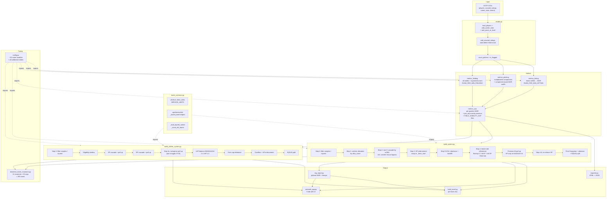

# Pistachio — Handover

## What this is

OOTP Baseball roster-construction tool. Takes the user's CSV exports from any
OOTP save, runs a metrics pipeline, then assigns every player to one of 7
levels (MLB → AAA → AA → A+ → A → R → R(DLR)) with positional Hungarian,
high-potential prospect enforcement, platoon-aware lineups, per-position
depth charts, and bullpen handedness balance. Renders to xlsx and a
Streamlit web UI.

## Where the work lives

- Branch `main` on the `pistachio` repo (this directory).
- Local raw sim data at `OOTP simulation/OOTP sims.xlsx` (committed).
- Active OOTP save: **`Rockies Rebuild.lg`** (see `config.filepath`).
- Recent HEAD progression (all this session, 2026-05-09 → 2026-05-10):
  - `60a3e65` — R-03 (opt-in): pitcher swingman pull-up toggle
  - `0d13e66` — C-02: roster-builder magic numbers moved to config.py
  - `62be25d` — C-01: extract `roster_common.py` for shared eligibility utils
  - `e3a23b7` — R-01: tighten catcher rescue threshold (bnw 0.30 → 1.5)
  - `cbbb8ee` — Janitor: dead code, doc drift, archive legacy calibration
  - `988f3b4` — T-01: roster-invariant pytest harness
  - `9fe3785` — Enforce service-time floor (`_bot`) at every demote site
  - `4d53a62` — HP age cap raised 23 → 24 (both hitters and pitchers)
  - `879e6d3` — Step 4: refine Backup C from below as well
  - `8635c0d` — Streamlit: show adjusted WAR everywhere; widen platoon lineups
  - `fa8a335` — Step 4: pick displacement target from post-promotion bench

## How to run

From PowerShell, in the project directory:

```powershell
python -m streamlit run streamlit_app.py
```

Browser opens at `http://localhost:8501`. Session-scoped gate forces a
fresh upload every browser tab — drop in OOTP CSVs from
`saved_games/Rockies Rebuild.lg/import_export/csv/`. Required:
`players.csv`, `players_scouted_ratings.csv`. Recommended: the two
`players_career_*_stats.csv` files (drive service-time data) **and
`teams.csv`** (drives R(DLR) DSL-team count for the best/rest split).

CLI: `python app.py refresh` then `python app.py rosters --team COL`.

Run the test suite (~60s): `python -m pytest tests/`.

## Pipeline at a glance



## Test harness (T-01)

`tests/test_roster_invariants.py` runs `main()` for all 30 MLB orgs and
asserts 13 invariants per org (390 total cases). Catches the entire
class of bugs spotted this session by reading rosters manually:

- No service-floor / top-ceiling violations
- No over-capacity rosters
- Each HP appears at exactly one level
- `placed + overflow + flagged + complex == loaded` (no lost players)
- MLB has 13 hitters, SP slots respect stamina gate, LHP balance honoured

`pytest tests/` runs in ~60s. **Run it after any builder change.** The
suite caught a real over-cap bug during R-03 development before commit.

## Tunable thresholds (config.py)

All roster-construction thresholds live in `config.py` under the
"Roster builder tunables" section. Tweak any without source edits:

| Constant | What it controls | Default |
|---|---|---|
| `ROSTER_SIZES_HITTER` | Per-level hitter slot capacity | MLB→A=13, R/R(DLR)=15 |
| `WOBA_MIN_HITTER` | Per-level wOBA eligibility floor | MLB=.280, AAA=.250, ... |
| `PREMIUM_WOBA_RELAX` | wOBA floor relax for C/SS/CF | .005 |
| `LINEUP_RHP_WEIGHT` | Standard-lineup vs-RHP weighting | .725 |
| `C_FLD_WEIGHT`, `AGE_WEIGHT`, `AGE_CAP` | catcher_alloc_score components | .05 / .002 / 30 |
| `C_FLD_GAP_MAX` | Max non-C glove gap for catcher candidate | 1.5 |
| `CATCHER_RESCUE_MIN_NON_C_WAR` | Bnw threshold for catcher-bypass rescue | **1.5** (raised from 0.30 in R-01) |
| `CATCHER_RESCUE_NON_C_POSITIONS` | Positions counted in bnw | DH, 1B, LF, RF, 3B |
| `HP_MAX_AGE`, `HP_BESTP_ADJ_THRESHOLD`, `HP_WOBA_THRESHOLD` | Hitter HP gate | 24 / 2.0 / .340 |
| `PREMIUM_FLD_MIN`, `HP_PREMIUM_FIT_POSITIONS` | Premium-glove anchor | 1.5 / (CF, SS, 2B) |
| `IF_POSITIONS`, `OF_POSITIONS` | Position groupings for utility roles | (2B, 3B, SS) / (LF, CF, RF) |
| `SP_PER_LEVEL`, `RP_PER_LEVEL` | Pitcher rotation / bullpen size | 5 / 8 |
| `PWOBA_MAX` | Per-level pwOBA ceiling | MLB=.345, AAA=.370, ... |
| `LHP_LEVELS`, `LEFTY_MIN/TARGET/MAX`, `LEFTY_TARGET_MAX_COST` | Bullpen handedness balance | (MLB,AAA,AA) / 2,3,4 / 0.010 |
| `HP_PITCHER_MAX_AGE`, `HP_PITCHER_MAX_PWOBAP` | Pitcher HP gate | 24 / .330 |
| `PITCHER_SWINGMAN_PULLUP_ENABLED` | **Opt-in R-03 toggle** (long-relief pull-up) | **False** |
| `PITCHER_SWINGMAN_PULLUP_MIN_WARP_DELTA` | Threshold for swingman call-up | 0.5 |

## Catcher rescue rule (post R-01)

`build_system.main` Step-1.5 ("rescue") routes a primary catcher
through the non-catcher cascade if BOTH:
- `_top == MLB` (wOBA clears MLB threshold), AND
- `best_non_c_war(p) >= CATCHER_RESCUE_MIN_NON_C_WAR` (1.5)

Effect: only **bat-elite catchers** (Soderstrom, Smith, Wells,
Langeliers, Raleigh, etc.) bypass alloc_score-based Step-1 catcher
allocation. Defense-first backups (Heineman pre-fix wOBA .302 / bnw
0.60) stay in Step-1 where their glove value drives placement.

The Step-4 Backup C refinement (commit `879e6d3`) catches any edge
case where a high-alloc catcher is at the wrong level — e.g.,
Heineman still ends up at MLB Backup C even when the rescue rule
correctly excludes him.

## R-03 swingman toggle (opt-in)

When `config.PITCHER_SWINGMAN_PULLUP_ENABLED = True`, the pitcher
system runs an extra Step-4a pass: pulls non-MLB SP-viable non-HP
arms up to the MLB bullpen if their `rp_warP` exceeds the worst MLB
RP's by 0.5+ WAR, preserving MLB LHP balance. Off by default
because most candidates are net-negative in current-year `rp_war`
(only positive in projected `rp_warP`) — turn on if you prefer
"call up the prospect for an MLB audition" over current-year
roster stability.

With toggle ON: 4 orgs see RHP-for-RHP swaps:
- ATL Hamilton ↔ Kinley
- CWS Sandlin + Paez ↔ Davitt + Tyson Miller
- HOU Pecko ↔ Maldonado
- PIT Bubba Chandler ↔ Darrell-Hicks

## Critical files

| File | Role |
|---|---|
| `config.py` | All constants + roster tunables (post C-02) |
| `roster_common.py` | Shared eligibility utils (LEVELS, MAX_AGE, age/service/dsl floors, injured.txt loader, DSL counter). Both builders import. **(post C-01)** |
| `metrics_pitching.py` | Multiplicative components, role-mask gating, component-aware WAR |
| `metrics_hitting.py` | Linear wOBA → runs → WAR |
| `metrics_fielding.py` | 1D table sums + 3B (55,55) interaction + asymmetric-tanh saturation |
| `metrics_war.py` | Per-position bat+def+pos_adj; `field` filtered by FIELD_VIABILITY_GAP |
| `build_system.py` | Hitter rosters. Step 0–4.6, premium-fit pull-up, R(DLR) split |
| `build_pitcher_system.py` | Pitcher rosters. SP/RP cascades + pull-up + LHP balance + opt-in swingman |
| `build_excel.py` | xlsx renderer; uses org_report for platoon WAR + lineups |
| `org_report.py` | Platoon-WAR helpers + lineup builder (uses `RUNS_PER_WIN_HITTING`) |
| `streamlit_app.py` | 5-tab UI. Hitters tabs show `*_fld` and `*_adj`; platoon lineups stacked vertically |
| `exporter.py` | Adds `bestP_adj` + per-position `*_fld` to JSON exports |
| `tests/test_roster_invariants.py` | 390-case regression harness (T-01) |
| `tests/conftest.py` | Pytest fixtures + per-org parametrize hook |
| `outputs/PIPELINE_REVIEW.md` | Full methodology / code-quality review (34 findings, prioritised) |
| `calibration/pos_adj_sweep.py` | Grid sweep that produced current `POSITIONAL_ADJUSTMENT_RUNS` |
| `calibration/fit_saturation.py` | Per-position saturation fit |
| `calibration/fit_pitcher_v2.py` | Produced current `PITCHING_WAR_COEFFS` |
| `calibration/validate*.py`, `*_check.py`, `test_fixed_pos_adj.py` | Active validation scripts |
| `calibration/archive/` | Superseded calibration scripts + stale CSVs (post janitor) |

## Sample WAR values (Rockies Rebuild save)

### Top hitters by position
| Pos | Player | best_adj |
|---|---|---|
| SS | Bobby Witt Jr. (KC) | ~6.5 |
| 3B | Corey Seager (TEX) | ~6.2 |
| RF | Kyle Tucker (LAD) | ~7.2 |
| CF | Roman Anthony (BOS, rookie) | ~7.7 |
| C | Cal Raleigh (SEA) | ~5.4 |

### Top pitchers
| Pitcher | sp_war |
|---|---|
| Tarik Skubal (DET) | ~5.6 |
| Garrett Crochet (BOS) | ~4.9 |
| Paul Skenes (PIT) | ~4.7 |

## What's still pending

See `outputs/PIPELINE_REVIEW.md` for the full prioritised action list.
Highlights of what's NOT done:

1. **M-03 (pitcher RP leverage WAR)** — currently `rp_war = sp_war × 0.333` (workload only). FG applies leverage multiplier (~1.5-2× for closers). Acceptable as cosmetic / external-comparability gap; explicitly skipped this session.
2. **M-05 (IF cross-position routing)** — ~9/35 elite-glove DRS leaders mismatch (Hayes/Urias/Garcia routed to SS by OOTP IF range/arm distribution). Needs a 2D RNG×ARM grid for 2B / SS — requires new sim data.
3. **C-05 / C-06 (metrics duplication, vectorize df.apply)** — code-quality items; not user-visible.
4. **C-09 (rename injured.txt / flagged.txt)** — disambiguate; future-bug-prevention only.
5. **R-04 (pitcher platoon staff variants)** — pwOBAR / pwOBAL exist but not used for vsR/vsL rotation construction.

## Methodology limitations (carried forward)

- **OOTP wOBA distribution offset**: OOTP star hitters cluster ~22 wOBA points below MLB (Witt OOTP .354 vs MLB .376). Hitting slope flatter than MLB-equivalent. Acceptable as internal-consistency choice — within-OOTP rankings correct.
- **Catcher framing engine plateau**: OOTP caps framing at +8 runs (Cfram ≥ 65 collapse). C `pos_adj` is +7.5 vs FG's +12.5 partly because of this. Engine constraint, not our model.
- **Pitcher RP WAR is workload-only**: see M-03 above.

## Quick smoke test

```powershell
python app.py refresh
python -m pytest tests/                      # 390 cases, ~60s
python -X utf8 calibration/top10_per_pos.py  # spot-check top players per position
```

Expected: pytest 390/390 pass. Top SS = Witt ~6.5, top RF = Tucker ~7.2.
